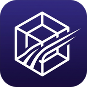

# 1Panel Community Apps Store

Curated, high-quality, ready-to-use local app store for 1Panel. Follows official specifications with data persistence and one-command synchronization.

[简体中文](./README.md) · [Packaging Specification](./1Panel本地应用制作规范.md)

---

## 📖 Overview

This repository provides an open extension library for **[1Panel](https://1panel.cn/)** users. All application packages follow the official 1Panel local app structure and are tailored for VPS and home server deployments with built-in data persistence, proper file permissions, and optimized resource footprints.

---

## 🚀 Quick Start

### Option 1: One-Line Automatic Sync (Recommended)

Run the following command directly on your 1Panel server terminal:

```bash
curl -sSL https://raw.githubusercontent.com/mainsir/1panel-apps/main/scripts/sync-to-1panel.sh | bash
```

---

### Option 2: 1Panel Scheduled Task (Automatic Daily Updates)

Keep your local store up to date automatically:

1. In 1Panel web dashboard, go to **Cron** (计划任务) → **Create Task**.
2. Task Name: `Sync Community Apps`.
3. Schedule: `Daily` (e.g. `03:00`).
4. Type: `Shell Script`.
5. Script Content:
   ```bash
   curl -sSL https://raw.githubusercontent.com/mainsir/1panel-apps/main/scripts/sync-to-1panel.sh | bash
   ```
6. Save the task.

---

## 🖥️ How to Install Apps in 1Panel (3 Easy Steps)

1. **Open App Store**: Navigate to **App Store** on the left menu.
2. **Refresh Catalog**: Click **"Update App List"** (更新应用列表) in the top right corner.
3. **Install**: Select the **"Local"** (本地) category, find your desired app, and click **Install**.

---

## 📦 Included Applications

| Icon | App Key | App Name | Category | Arch | Highlights |
|:---:|:---|:---|:---:|:---:|:---|
|  | [3proxy](./apps/3proxy) | **3proxy** | Tool | amd64 / arm64 | Tiny, fast HTTP and SOCKS5 proxy server configured via environment variables |
|  | [gitea-sqlite](./apps/gitea-sqlite) | **Gitea (SQLite)** | DevOps | amd64 / arm64 | Single-container Gitea with embedded SQLite3; no MySQL needed; runs on 1 vCPU / 1GB RAM |
|  | [kasmweb-chrome](./apps/kasmweb-chrome) | **Kasm Chrome** | Tool | amd64 | Web-accessible 60fps Chrome browser powered by KasmVNC WebRTC; audio, clipboard, and profile persistence |
|  | [sing-box-reality](./apps/sing-box-reality) | **VLESS Reality** | Tool | amd64 | Lightweight VLESS Reality inbound service via sing-box; auto secret generation |

---

## 🛠️ Contribution & Spec

Check our packaging guide before creating new packages:

👉 **[1Panel Local App Packaging Specification (Guide)](./1Panel本地应用制作规范.md)**

---

## 📄 License

Distributed under the [MIT License](LICENSE).
Upstream container images belong to their respective authors and maintainers.
